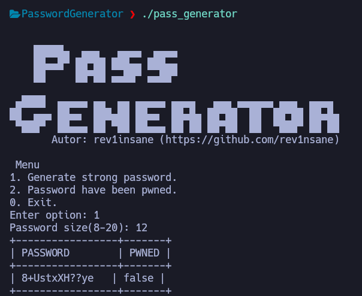
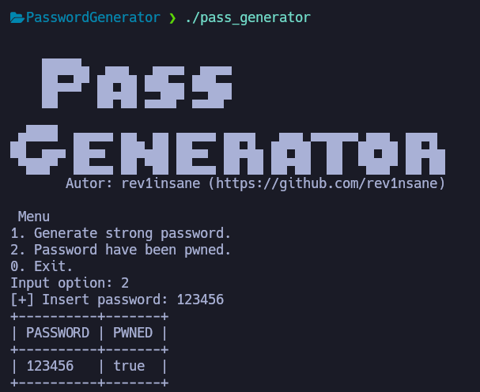

# Strong password generato
A simple tool to generate strong and secure passwords.

Strong passwords are one of the simplest yet most effective defences against cyber attacks.

# ⭐ Features
- Generate strongs password with 8 to 12 characteres
- Include uppercase, lowercase, numbers, and symbols.
- Verifies the password against a known data breach database.
- Allows the user to input a password to validate its breach status.

# 📦 Installation
Install required dependencies:
```shell
sudo apt update
sudo apt install g++ libcurl4-openssl-dev libssl-dev
```

# 🛠️ Build
Compile the project using the build script:
```shell
./build.sh
```

# ▶️ Run
Execute the password generator:
```shell
./pass_generator
```

# Example output
Generate a password and check if it has been pwned


Enter your owner password and verify if it has been pwned

